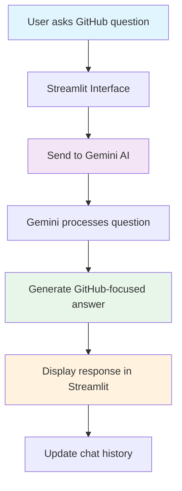
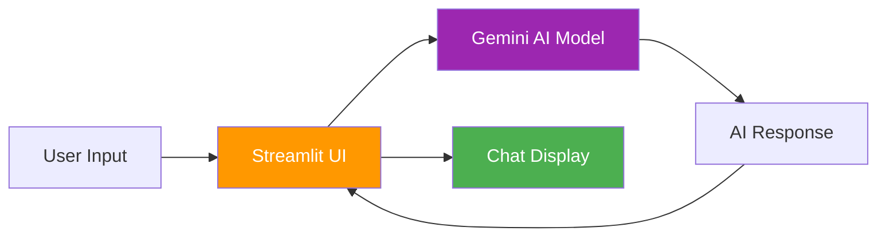
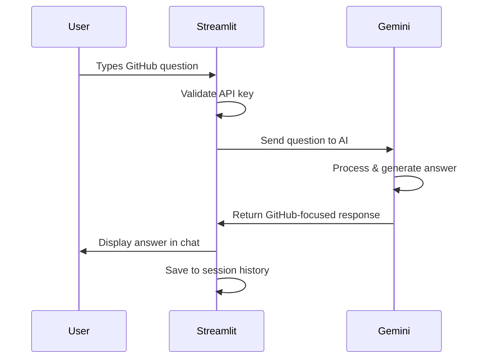

# 🤖 GITBOT-CHATBOT

GitBot is a simple yet powerful AI assistant designed to help developers, beginners, and professionals with Git and GitHub questions. Built with Streamlit and powered by Google's Gemini AI, it provides direct, intelligent answers to all your Git and GitHub queries.

## 🌟 Features

- **🧠 AI-Powered**: Direct integration with Google Gemini Pro for intelligent responses
- **🎯 GitHub-Focused**: Specialized in answering Git and GitHub related questions
- **⚡ Simple & Fast**: Lightweight application with instant responses
- **🎨 Clean Interface**: User-friendly Streamlit web interface
- **💬 Interactive Chat**: Real-time conversation with chat history
- **🔒 Secure**: API key handled securely through Streamlit sidebar

## 🏗️ Simple Architecture

### System Workflow



### Technology Stack



## 🚀 Quick Start

### Prerequisites

- Python 3.8+
- Google AI Studio API key ([Get it here](https://makersuite.google.com/app/apikey))

### Installation & Setup

1. **Clone the repository**
   ```bash
   git clone https://github.com/Void-Anvesha/GITBOT-CHATBOT.git
   cd GITBOT-CHATBOT
   ```

2. **Install dependencies**
   ```bash
   pip install -r requirements.txt
   ```

3. **Run the application**
   ```bash
   streamlit run app.py
   ```

4. **Start chatting**
   - Open browser at `http://localhost:8501`
   - Enter your Gemini API key in the sidebar
   - Ask any GitHub/Git question!

## 📦 Dependencies

```txt
streamlit>=1.28.0
google-generativeai>=0.3.0
```

## 📁 Project Structure

```
GITBOT-CHATBOT/
├── 📄 app.py                  # Main Streamlit application
├── 📄 requirements.txt        # Python dependencies  
├── 📄 README.md              # This file
└── 📁 assets/                # Optional: images, logos
    └── 📄 demo.gif           # Demo screenshot
```

## 🎯 What GitBot Can Answer

### 🔰 **Git Basics**
- "How do I initialize a Git repository?"
- "What's the difference between git add and git commit?"
- "How do I clone a repository?"

### 📁 **Repository Management** 
- "How do I create a new repository on GitHub?"
- "How do I upload files to my repository?"
- "How do I make my repository private/public?"

### 🔄 **Git Workflow**
- "How do I create and switch branches?"
- "What are pull requests and how do I make one?"
- "How do I merge branches?"

### 🐛 **Troubleshooting**
- "How do I undo my last commit?"
- "How do I resolve merge conflicts?"
- "How do I delete a branch?"

### 👥 **Collaboration**
- "How do I fork a repository?"
- "How do I contribute to open source projects?"
- "What is the GitHub workflow?"

## 💬 Example Conversations

### Basic Git Commands
```
👤 User: How do I commit my changes?

🤖 GitBot: To commit your changes in Git:

1. First, stage your changes:
   git add . (for all files)
   git add filename (for specific file)

2. Then commit with a message:
   git commit -m "Your descriptive message"

3. Finally, push to GitHub:
   git push origin main

The commit message should briefly describe what changes you made!
```

### Repository Creation
```
👤 User: How do I create a new GitHub repository?

🤖 GitBot: Here's how to create a new repository on GitHub:

1. Go to GitHub.com and sign in
2. Click the "+" icon in the top-right corner
3. Select "New repository"
4. Enter a repository name
5. Add a description (optional)
6. Choose Public or Private
7. Initialize with README if you want
8. Click "Create repository"

You can then clone it locally with:
git clone https://github.com/yourusername/repository-name.git
```

## 🔧 Application Workflow

### Simple Process Flow



### Core Components

#### **Streamlit Interface** (`app.py`)
```python
# Main components:
1. Title and header
2. Sidebar for API key input
3. Chat input field  
4. Message history display
5. Session state management
```

#### **AI Integration**
```python
# Simple Gemini integration:
1. Configure API with user's key
2. Send user question directly to Gemini
3. Receive and display response
4. No complex processing or RAG
```

## 🎨 User Interface Features

### **Main Chat Area**
- Clean conversation view
- User messages on the right
- Bot responses on the left
- Automatic scrolling to latest message

### **Sidebar Configuration**
- Secure API key input (password field)
- Quick help and instructions
- List of example questions to try

### **Session Management**
- Chat history preserved during session
- Clear conversation option
- Responsive design for mobile/desktop

## 🛠️ How It Works

### **Step-by-Step Process:**

1. **User Input**: User types a GitHub/Git question
2. **Validation**: App checks if Gemini API key is provided
3. **AI Call**: Question sent directly to Gemini AI model
4. **Response**: Gemini generates GitHub-focused answer
5. **Display**: Response shown in chat interface
6. **History**: Conversation stored in session state

### **Code Structure:**
```python
# Simplified app structure:

import streamlit as st
import google.generativeai as genai

# Configure page
st.set_page_config(title="GitBot")

# Sidebar for API key
api_key = st.sidebar.text_input("API Key", type="password")

# Main chat interface  
if api_key:
    # Configure Gemini
    genai.configure(api_key=api_key)
    model = genai.GenerativeModel('gemini-pro')
    
    # Chat interface
    user_question = st.chat_input("Ask about Git/GitHub...")
    
    if user_question:
        # Get AI response
        response = model.generate_content(user_question)
        
        # Display conversation
        # (Implementation details...)
```

## ✨ Key Benefits

### **Simplicity**
- No complex setup or configuration
- Direct AI integration without middleware
- Lightweight and fast

### **Focus**
- Specialized for GitHub/Git questions
- Trained AI responses for developer needs
- No unnecessary features or complexity

### **Accessibility**  
- Web-based interface accessible anywhere
- No installation required for end users
- Mobile-friendly design

## 🚀 Getting Started Tips

### **For Beginners:**
1. Start with basic questions like "What is Git?"
2. Ask for step-by-step instructions
3. Try questions about repository creation

### **For Developers:**
1. Ask about specific Git commands
2. Get help with workflow issues  
3. Learn GitHub best practices

### **Example Starter Questions:**
- "How do I start using Git?"
- "What's the difference between Git and GitHub?"
- "How do I upload my project to GitHub?"
- "How do I collaborate with other developers?"

## 📱 Demo

Visit the live application and try these example questions:
- "How do I create my first repository?"
- "What are the basic Git commands I should know?"
- "How do I contribute to an open source project?"

## 🤝 Contributing

Feel free to contribute to this project:
1. Fork the repository
2. Create a feature branch
3. Make your improvements
4. Submit a pull request

## 📄 License

This project is open source and available under the [MIT License](LICENSE).

---

**Made with ❤️ for the GitHub community**

*Simple, direct, and effective - just like good code should be!*
